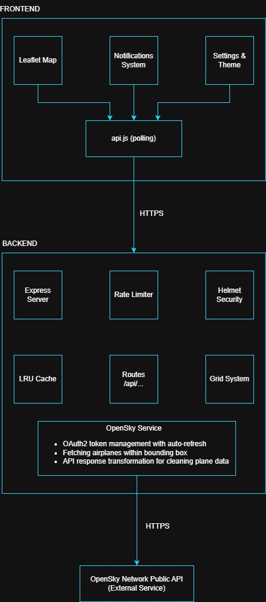

# Metal Birds Watch

<p align="center">
  
</p>

<p align="center">
  <strong>Real-time aircraft watching with live notifications when planes fly overhead</strong>
</p>

<p align="center">
  <a href="https://metalbirdswatch.pilotronica.com">Live Demo</a> •
  <a href="#features">Features</a> •
  <a href="#-quick-start-for-contributors">Quick Start</a> •
  <a href="#how-to-contribute">How to Contribute?</a>
</p>

---

## About

**Metal Birds Watch** is a real-time aircraft watching web application that notifies you when planes fly overhead. Built for aviation enthusiasts (like me) who want to know what's happening in the sky above them.

The app uses the [OpenSky Network](https://opensky-network.org/), a public API to fetch live flight data and displays aircraft on an interactive map with real-time updates, sound notifications, and detailed flight information.

**Key Highlights:**
- 🔒 **Privacy-first**: No data stored, no tracking, no cookies
- ⚡ **Real-time**: Live updates every 25-30 seconds
- 📱 **Responsive**: Works on desktop, tablet, and mobile
- 🌙 **Dark/Light themes**: Auto-switches based on time of day
- 🔔 **Notifications**: Audio alerts and browser notifications for nearby aircraft

---

## Features

### Core Features

| Feature                     | Description                                                            |
| --------------------------- | ---------------------------------------------------------------------- |
| **Live Aircraft Watching**  | Real-time plane positions on an interactive Leaflet map                |
| **Proximity Notifications** | Sound and browser notifications when planes enter your radius          |
| **Distance Zones**          | Color-coded zones (close/medium/far) for visual proximity              |
| **Flight Logbook**          | List all planes you've spotted with export to JSON/CSV                 |
| **Sky Activity Indicator**  | Shows current air traffic level around your area (idle → very Busy)    |
| **Persistent Stats**        | Records fastest speed, current closest distance, total aircraft spotted |

### User Experience

| Feature                       | Description                                                    |
| ----------------------------- | -------------------------------------------------------------- |
| **Auto Theme Option**                | Switches between dark/light based on time of day (6 AM / 6 PM) |
| **Unit Preferences**          | Toggle between metric (km, m) and imperial (mi, ft)            |
| **Speed Conversion in Knots** | Toggle between mph or km/h and knots based on your preference  |
| **Sound Controls**            | Enable/disable notification sounds                             |
| **Settings Persistence**      | Preferences saved to localStorage                              |
| **Mobile Hamburger Menu**     | Responsive navigation for small screens                        |

### Security & Performance

| Feature                        | Description                                                   |
| ------------------------------ | ------------------------------------------------------------- |
| **Content Security Policy**    | Strict CSP headers prevent XSS attacks                        |
| **Rate Limiting**              | 5 requests per 30 seconds per IP                              |
| **LRU Cache**                  | Smart caching reduces API calls (25s TTL, 500 grid cells max) |
| **Grid-based Caching**         | Nearby users share cached data                                |
| **Thundering Herd Prevention** | Concurrent requests wait for single API call                  |

---

## 🏗️ Architecture



---

## 📁 Project Structure

```
metal-birds-watch/
├── frontend/                   # Static frontend (GitHub Pages)
│   ├── index.html              # Main HTML with CSP headers
│   ├── CNAME                   # Custom domain configuration
│   ├── css/
│   │   ├── variables.css       # CSS custom properties (colors, spacing)
│   │   ├── base.css            # Reset and base styles
│   │   ├── layout.css          # Header, stats panel, bottom bar
│   │   ├── components.css      # Modals, buttons, notifications
│   │   ├── animations.css      # Keyframe animations
│   │   └── mobile.css          # Responsive breakpoints
│   ├── js/
│   │   ├── config.js           # Frontend configuration
│   │   ├── app.js              # Main application logic
│   │   ├── api.js              # Backend API communication
│   │   ├── map.js              # Leaflet map initialization
│   │   ├── notifications.js    # Sound and browser notifications
│   │   ├── logbook.js          # Flight logbook with export
│   │   ├── settings.js         # User preferences
│   │   ├── theme.js            # Dark/light theme switching
│   │   ├── info.js             # About/roadmap modals
│   │   └── utils.js            # Helper functions
│   └── assets/
│       ├── icons/              # Logo and app icons
│       ├── images/             # Other photos
│       └── sounds/             # Notification sounds
│
├── backend/                    # Node.js API server
│   ├── server.js               # Express server setup
│   ├── config.js               # Server configuration
│   ├── .env.example            # Environment variables template
│   ├── railway.json            # Railway deployment config
│   ├── routes/
│   │   ├── planes.js           # POST /api/planes endpoint
│   │   └── admin.js            # Admin endpoints (cache management)
│   ├── middleware/
│   │   ├── rateLimit.js        # Request rate limiting
│   │   ├── validate.js         # Coordinate validation
│   │   └── adminAuth.js        # Admin API authentication
│   └── services/
│       ├── opensky.js          # OpenSky API integration
│       ├── cache.js            # LRU cache management
│       └── grid.js             # Geo grid calculations
│
├── .github/
│   └── workflows/
│       └── deploy-pages.yml    # GitHub Pages deployment
│
├── LICENSE                     # MIT License
└── README.md                   # You are here
```

---

## 🚀 Quick Start (For Contributors)

### Prerequisites
- Node.js 18+
- npm or yarn
- OpenSky Network account (free) with OAuth2 credentials

### 1. Clone the Repository

```bash
git clone https://github.com/georgekobaidze/metal-birds-watch.git
cd metal-birds-watch
```

### 2. Setup Backend

```bash
cd backend
npm install
cp .env.example .env
```

Edit `.env` with your own credentials:

```env
# Server
PORT=3000
NODE_ENV=development

# OpenSky API (get credentials from https://opensky-network.org/)
OPENSKY_BASE_URL=https://opensky-network.org/api
OPENSKY_AUTH_URL=https://opensky-network.org/api/oauth/token
OPENSKY_CLIENT_ID=your_client_id
OPENSKY_CLIENT_SECRET=your_client_secret

# CORS (must include the URL(s) where your frontend is served)
CORS_ORIGINS=http://localhost:3000,http://localhost:8080

# Admin API (optional)
ADMIN_API_KEY=your_secure_random_key
```

Start the backend:

```bash
npm run dev    # Development with auto-reload
# or
npm start      # Production
```

### 3. Run Frontend

**Important:** Always use a local web server for development. Opening `index.html` directly via `file://` will cause the frontend to use the production API instead of your local backend.

Start a local server:

```bash
cd frontend
npx serve -l 8080 .
# or
python -m http.server 8080  # This one is my personal preferred option
```

Then open `http://localhost:8080` in your browser.

---

## ⚙️ Configuration

### Backend Configuration (`backend/config.js`)

| Setting                   | Default | Description                     |
| ------------------------- | ------- | ------------------------------- |
| `PORT`                    | 3000    | Server port                     |
| `CACHE_TTL_SECONDS`       | 25      | How long to cache API responses |
| `GRID_SIZE_DEGREES`       | 0.2     | Grid cell size (~22km per cell) |
| `FETCH_RADIUS_KM`         | 25      | Radius to fetch from OpenSky    |
| `RATE_LIMIT_WINDOW_MS`    | 30000   | Rate limit window (30 seconds)  |
| `RATE_LIMIT_MAX_REQUESTS` | 5       | Max requests per window per IP  |

### Frontend Configuration (`frontend/js/config.js`)

| Setting                   | Default | Description                   |
| ------------------------- | ------- | ----------------------------- |
| `DETECTION_RADIUS_KM`     | 12      | User's detection radius       |
| `DISTANCE_CLOSE`          | 3       | "Close" zone threshold (km)   |
| `DISTANCE_MEDIUM`         | 7       | "Medium" zone threshold (km)  |
| `DISTANCE_FAR`            | 12      | "Far" zone threshold (km)     |
| `MAP_ZOOM_DEFAULT`        | 11      | Default map zoom level        |
| `THEME_SWITCH_HOUR_NIGHT` | 18      | Hour to switch to dark theme  |
| `THEME_SWITCH_HOUR_DAY`   | 6       | Hour to switch to light theme |

---

## API Reference

### `POST /api/planes`

Fetch aircraft near a location.

**Request:**
```json
{
  "latitude": 51.5074,
  "longitude": -0.1278
}
```

**Response:**
```json
{
  "planes": [
    {
      "icao24": "icao24_value",
      "callsign": "callsign_value",
      "origin": "Origin",
      "latitude": 51.512,
      "longitude": -0.089,
      "altitude": 10500,
      "velocity": 420,
      "heading": 90,
      "on_ground": false,
      "distance": 5.2
    }
  ],
  "cacheAge": 12,
  "nextUpdateIn": 18
}
```

**Rate Limit:** 5 requests per 30 seconds per IP

### `GET /api/health`

Health check endpoint.

**Response:**
```json
{
  "status": "ok",
  "timestamp": "2026-02-08T12:00:00.000Z"
}
```

### `GET /api/admin/cache/snapshot`

Get cache statistics (requires `X-API-KEY` header).

### `POST /api/admin/cache/clear`

Clear all cached data (requires `X-API-KEY` header).

---

## Security Features

| Feature                     | Implementation                                                        |
| --------------------------- | --------------------------------------------------------------------- |
| **Content Security Policy** | Strict CSP meta tag blocks inline scripts and unauthorized sources    |
| **Helmet.js**               | Sets security headers (X-Frame-Options, X-Content-Type-Options, etc.) |
| **Rate Limiting**           | Per-IP limits on all endpoints                                        |
| **Input Validation**        | Coordinate bounds checking (lat: -90 to 90, lon: -180 to 180)         |
| **CORS**                    | Whitelist-based origin validation                                     |
| **Admin Auth**              | API key authentication with brute-force protection                    |
| **No Data Storage**         | Stateless design - no user data persisted                             |
| **Error Sanitization**      | Generic error messages to users (no stack traces)                     |

---

## Performance Optimizations

| Optimization                   | Benefit                                             |
| ------------------------------ | --------------------------------------------------- |
| **LRU Cache**                  | Reduces OpenSky API calls (500 grid cells, 25s TTL) |
| **Grid-based Caching**         | Nearby users (~22km) share cached data              |
| **Thundering Herd Prevention** | Concurrent requests wait for single API call        |
| **Response Jitter**            | Spreads out client polling (0-5s random delay)      |
| **Image Optimization**         | Compressed assets (logo: 45KB, author: 20KB)        |
| **Deferred Scripts**           | All JS loads with `defer` attribute                 |
| **Resource Preloading**        | Critical assets preloaded in `<head>`               |

---

## Development

### Code Structure

**Frontend modules:**
- `app.js` - Main polling loop and stats updates
- `api.js` - Backend communication with retry logic
- `map.js` - Leaflet map and plane markers
- `notifications.js` - Sound/browser notification system
- `logbook.js` - Flight history with localStorage
- `settings.js` - User preferences modal
- `theme.js` - Auto dark/light theme
- `utils.js` - Shared helpers (escapeHtml, showModal, etc.)

**Backend services:**
- `opensky.js` - OAuth2 token management and API calls
- `cache.js` - LRU cache with TTL
- `grid.js` - Geo calculations (bounding box, haversine distance)

### Debug Mode

Debug logging is automatically enabled on `localhost` and `127.0.0.1`:

```javascript
// frontend/js/utils.js
const DEBUG_MODE = window.location.hostname === 'localhost' || window.location.hostname === '127.0.0.1';
```

---

## What's Next?

- [ ] More aircraft information (type, photos)
- [ ] Weather overlay integration
- [ ] Mobile app version (React Native)
- [ ] Desktop app version (Electron)
- [ ] Smartwatch app version
- [ ] Customizable tracking radius
- [ ] Altitude filters
- [ ] Favorite aircraft notifications

---

## How to Contribute?

Contributions are welcome! Please:

1. Fork the repository
2. Create a feature branch (`git checkout -b feature/amazing-feature`)
3. Commit changes (`git commit -m 'Add amazing feature'`)
4. Push to branch (`git push origin feature/amazing-feature`)
5. Open a Pull Request targeting the `develop` branch.

---

## License

This project is licensed under the MIT License - see the [LICENSE](LICENSE) file for details.

---

## Acknowledgments

- [OpenSky Network](https://opensky-network.org/) for the flight data API
- [Leaflet](https://leafletjs.com/) for the interactive maps
- [OpenStreetMap](https://www.openstreetmap.org/) for map tiles
- Built for the [DEV.TO Copilot Challenge](https://dev.to/devteam/join-the-github-copilot-cli-challenge-win-github-universe-tickets-copilot-pro-subscriptions-and-50af)

---

## Author

**Giorgi Kobaidze** (Pilotronica)

- GitHub: [@georgekobaidze](https://github.com/georgekobaidze)
- LinkedIn: [giorgikobaidze](https://www.linkedin.com/in/giorgikobaidze/)
- Twitter/X: [@georgekobaidze](https://x.com/georgekobaidze)
- DEV.TO: [georgekobaidze](https://dev.to/georgekobaidze)
- Discord: [Join the community](https://discord.gg/D7F6wMf6)

---

<p align="center">
  Made with ☕ and ✈️ by Giorgi Kobaidze
</p>